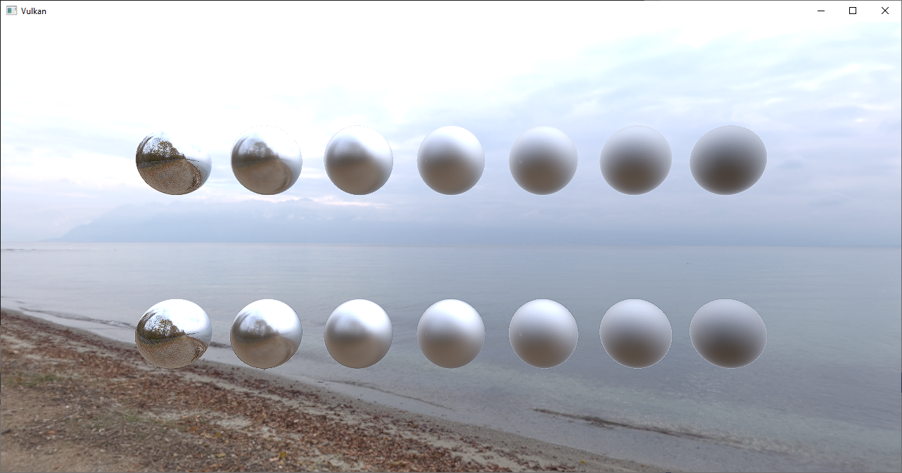

# Vulkan Samples Dictionary

Vulkan Samples Dictionary is a project that includes both vulkan examples written in C++ and a ReadTheDoc page serving as a dictionary introducing each example.

## Purpose

This project aims to offer people a place for reference, which I believe can smooth the learning curve and reduce the costs of using Vulkan API to build useful compute/graphics products.

Currently, you can find some good resources on learning Vulkan. But few can be used as an efficient reference and we introduce them here ([Current Vulkan resources](https://vulkan-samples-dictionary.readthedocs.io/en/latest/#current-vulkan-resources)) for you to compare and see why this project maybe more helpful than others as a reference.

However, this project is not suitable as a starting point for learning Vulkan. I recommend you to check out the [Vulkan tutorial](https://vulkan-tutorial.com/) to get some basic ideas about Vulkan before you dive into this repo.

## Design Principles

* *Easy to build*:

  Each samples only has its own CMakeList.txt file and one source file with several shader files.

* *Small topics*:

  Entry level samples focus on correctly using API commands (Within 500 lines);

  Mid level samples focus on small use cases like triangle rendering (Within 2000 lines);

  Upper level samples focus on relatively large and common topics like deferred rendering (Within 5000 lines);

* *Easy to find*:

  You can search keywords that you are interested in in the dictionary.

* *Easy to read*:

  Code would be extensively commented and you can find more info on their own pages. Besides, we also separate debug mode code and release mode code of each samples to make your reading more enjoyable. In addition, most topics have two versions of examples: debug and release. The release version wouldn't contain extensively debug checking while the debug version would have. So, the release version maybe better for referencing necessary functionalities.

* *Convenient to copy and paste*:

  Abstraction of the code would be kept as less as possible. Although it doesn't necessarily adhere to software engineering principles, it makes it much easier to just copy the code to your own projects and run them.

## Clone this repo

`git clone --recurse-submodules https://github.com/JerryYan97/Vulkan-Samples-Dictionary.git`

## For more details

Please check [this dictionary](https://vulkan-samples-dictionary.readthedocs.io/en/latest/#).

## 3rd party software

* [Qt](https://www.qt.io/?hsLang=en)
* [Vulkan Memory Allocator](https://gpuopen.com/vulkan-memory-allocator/)
* [LodePNG](https://github.com/lvandeve/lodepng)